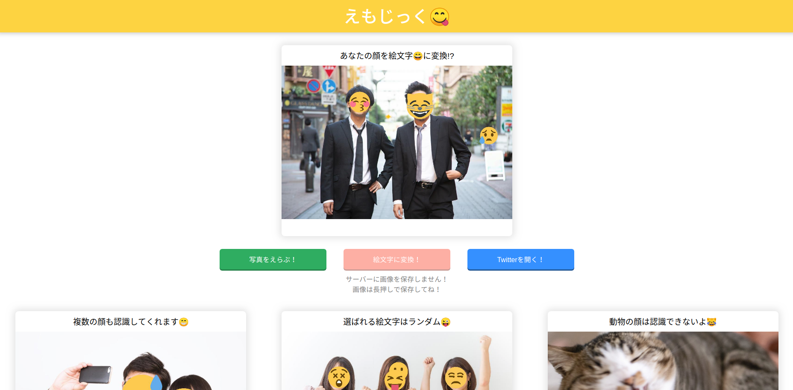
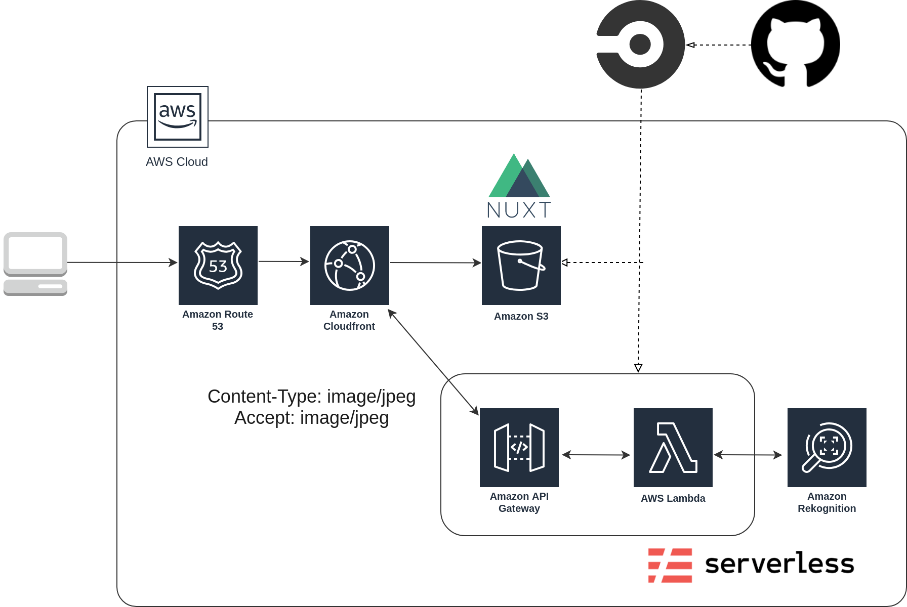

# [えもじっく](https://emojic.ch)

## Summray
[えもじっく](https://emojic.ch)は写真から顔を判定して、絵文字スタンプを貼り付けてくれるWebサービスです。

[https://emojic.ch](https://emojic.ch)

## Architecture

- [えもじっく](https://emojic.ch)のフロントエンドはNuxt.jsで構築されています。CircleCIでmasterブランチにマージされるたびにデプロイされます。
- バックエンドはAWS API GatewayとLambdaを用いたサーバーレスな構成で構築されています。
- Lambda関数はPythonで書かれており、OpenCVで顔認識を行っています。

## LICENSE
MIT